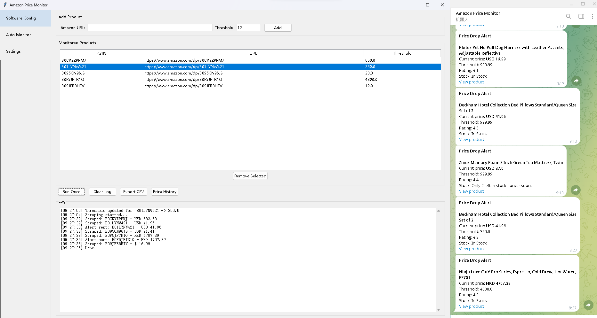
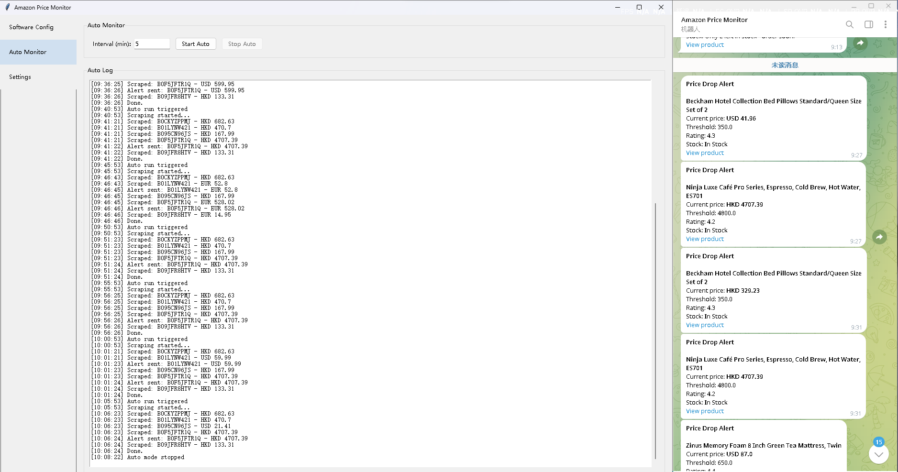

# Amazon Price Monitor

A desktop tool that monitors Amazon product prices and sends 
Telegram alerts when the price drops below a threshold.

## What It Does

- Add Amazon product URLs with a target price
- Scrapes price, rating, and stock status on demand or on schedule
- Sends a Telegram notification when price < threshold
- Exports price history to CSV
- Bilingual UI (English / Chinese)

## Tech Stack

- **Playwright** — async browser automation with stealth injection
- **BeautifulSoup** — HTML parsing with multi-selector fallback
- **Tkinter** — desktop GUI
- **Telegram Bot API** — notifications
- **PyInstaller** — packaged as standalone Windows .exe

## Key Features

- Anti-bot handling: detects "Continue shopping" page and retries
- Multi-selector price parsing (4 fallback containers)
- Runs 1–N products concurrently via asyncio
- Scheduled monitoring with countdown timer
- Persistent settings in JSON

## Multi-Currency Handling

Amazon may return prices in different currencies for the same 
ASIN depending on session, IP, or region. This tool parses 
all of them automatically:

- `USD 41.96` → currency=USD, price=41.96
- `HKD 329.23` → currency=HKD, price=329.23
- `$ 16.99` → currency=USD, price=16.99

No hardcoded currency assumption. Each price record stores 
its currency alongside the value.
## Screenshots

**Manual run — 5 products, mixed currencies, per-product thresholds:**



**Auto mode — 7 consecutive runs at 5-minute intervals over 32 minutes. 
Same ASIN returns HKD/EUR/USD depending on session, all parsed correctly. 
Each alert in the log matches a Telegram message on the right:**



## How to Run

```bash
pip install -r requirements.txt
playwright install chromium
python gui.py
